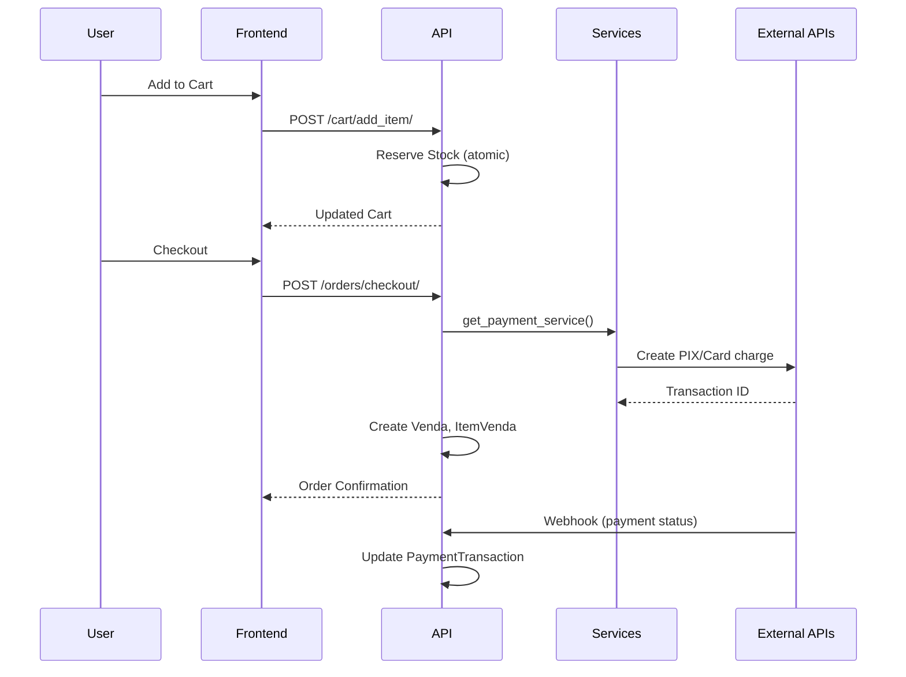

# Architecture Documentation - GBlack Store

## System Overview
GBlack Store is a full-stack e-commerce application with a modern dark-themed UI, complete purchase flow, inventory management, guest checkout, and external service integrations for payments, shipping, invoices, and marketplaces.

## Tech Stack

| Layer | Technology |
|-------|------------|
| **Backend** | Python 3.x, Django 3.x, Django REST Framework |
| **Frontend** | React 18, TailwindCSS, Axios, Lucide Icons |
| **Database** | SQLite (dev), PostgreSQL (production) |
| **Containerization** | Docker, Docker Compose |
| **External APIs** | MercadoPago, Melhor Envio, Marketplaces |

---

## Project Structure

```
gblack_store/
├── gbstr/                 # Django project settings
│   ├── settings.py        # Main configuration + integrations
│   └── urls.py            # Root URL routing
├── loja/                  # Main Django app
│   ├── models.py          # Data models
│   ├── api_views.py       # REST API endpoints
│   ├── serializers.py     # DRF serializers
│   ├── webhook_views.py   # External service webhooks
│   ├── services/          # External integrations
│   │   ├── base.py        # Interfaces & data classes
│   │   ├── payment.py     # MercadoPago integration
│   │   ├── shipping.py    # Melhor Envio integration
│   │   ├── invoice.py     # NF-e integration (stub)
│   │   └── marketplace.py # ML, Magalu, Shopee
│   └── tests_*.py         # Test modules
├── frontend/              # React SPA
│   ├── src/
│   │   ├── pages/         # Page components
│   │   ├── components/    # Reusable components
│   │   └── api.js         # Axios configuration
│   └── public/
└── scripts/               # Automation scripts
```

---

## Backend Architecture

### Models (`loja/models.py`)

| Model | Purpose |
|-------|---------|
| `Produto` | Products with inventory, pricing, discounts |
| `Carrinho` / `CartItem` | Shopping cart (user + guest support) |
| `Venda` / `ItemVenda` | Completed orders and line items |
| `PaymentTransaction` | Payment records and status |
| `Address` | Customer delivery addresses |
| `Cliente` | Extended user model |
| `FeedPost` | Social feed with product links |
| `StoreConfig` | Singleton store settings |

### API Endpoints (`loja/api_views.py`)

| Endpoint | Methods | Description |
|----------|---------|-------------|
| `/api/v1/products/` | GET, POST, PUT, DELETE | Product CRUD |
| `/api/v1/products/{id}/related/` | GET | Cross-sell products |
| `/api/v1/cart/` | GET | Get cart |
| `/api/v1/cart/add_item/` | POST | Add to cart (reserves stock) |
| `/api/v1/cart/remove_item/` | POST | Remove from cart |
| `/api/v1/cart/update_quantity/` | POST | Update quantity |
| `/api/v1/orders/` | GET | List orders |
| `/api/v1/orders/checkout/` | POST | Process checkout |
| `/api/v1/address/` | GET, POST | Address management |
| `/api/v1/feed/` | GET, POST | Feed posts |

### Webhook Endpoints (`loja/webhook_views.py`)

| Endpoint | Source | Purpose |
|----------|--------|---------|
| `/api/v1/webhooks/payment/` | MercadoPago | Payment status updates |
| `/api/v1/webhooks/shipping/` | Melhor Envio | Tracking updates |
| `/api/v1/webhooks/marketplace/<name>/` | Marketplaces | Order notifications |

---

## Services Layer (`loja/services/`)

### Service Interfaces

```python
# All services follow interface pattern with mock implementations
get_payment_service()    # Returns PaymentServiceInterface
get_shipping_service()   # Returns ShippingServiceInterface
get_invoice_service()    # Returns InvoiceServiceInterface
get_marketplace_service(name)  # Returns MarketplaceServiceInterface
```

### Configuration (Environment Variables)

```bash
# Payment (MercadoPago)
PAYMENT_GATEWAY=mercadopago|mock
MERCADOPAGO_ACCESS_TOKEN=...
MERCADOPAGO_PUBLIC_KEY=...

# Shipping (Melhor Envio)
SHIPPING_PROVIDER=melhorenvio|mock
MELHORENVIO_TOKEN=...
MELHORENVIO_SANDBOX=True|False

# Invoice (NF-e)
INVOICE_PROVIDER=mock|bling|tiny
BLING_API_KEY=...

# Marketplaces
ENABLED_MARKETPLACES=mercadolivre,magalu,shopee
MERCADOLIVRE_ACCESS_TOKEN=...
MAGALU_ACCESS_TOKEN=...
SHOPEE_ACCESS_TOKEN=...
```

---

## Frontend Architecture

### Design System
- **Theme**: Dark luxury (#0a0a0a background, #d4af37 gold accents)
- **Typography**: Inter font, bold weights
- **Components**: Glassmorphism navbar, dark cards, urgency badges

### Key Pages

| Page | Features |
|------|----------|
| `Home.jsx` | Hero banner, social proof, product grid, CTAs |
| `ProductDetail.jsx` | Image carousel, urgency badges, sticky buy button |
| `Cart.jsx` | Quantity controls, related products |
| `Checkout.jsx` | Address form, payment method selection |
| `Feed.jsx` | Social feed with product links |

### API Integration (`api.js`)
- Axios interceptor attaches `Authorization` token or `X-Guest-ID` header
- Base URL configurable via environment

---

## Data Flow



---

## Testing

### Test Modules

| File | Coverage |
|------|----------|
| `tests_sales.py` | Order creation, checkout flow |
| `tests_advanced_cart.py` | Cart operations, stock management |
| `tests_checkout_flow.py` | End-to-end checkout |

### Running Tests

```bash
# All tests
python manage.py test loja

# Specific module
python manage.py test loja.tests_sales

# With verbosity
python manage.py test loja --verbosity=2
```

### Pre-Deploy Verification

```bash
python scripts/pre_deploy.py
```
Runs all backend tests and builds frontend.

---

## Deployment

### Docker

```bash
docker-compose up --build
```

### Environment Variables Required for Production

```bash
DEBUG=False
SECRET_KEY=your-secret-key
DATABASE_URL=postgres://...
PAYMENT_GATEWAY=mercadopago
MERCADOPAGO_ACCESS_TOKEN=...
SHIPPING_PROVIDER=melhorenvio
MELHORENVIO_TOKEN=...
```

---

## Background Jobs

| Command | Purpose | Schedule |
|---------|---------|----------|
| `cleanup_carts` | Release stock from expired carts | Daily |
| `seed_products` | Populate sample products | Manual |

```bash
python manage.py cleanup_carts
python manage.py seed_products
```
